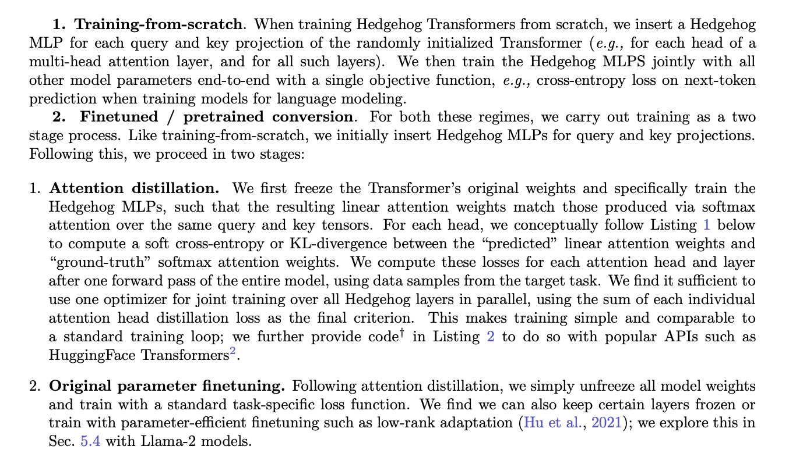

# Softmax Mimicry

paper: https://arxiv.org/pdf/2402.04347

</img>

This exploits the fact that the only difference between linear attention and standard is
the softmax is replaced with function mappings.

</img>
</img>

# Low rank Linear Conversion with Attention Transfer
</img>
paper https://arxiv.org/pdf/2410.10254
