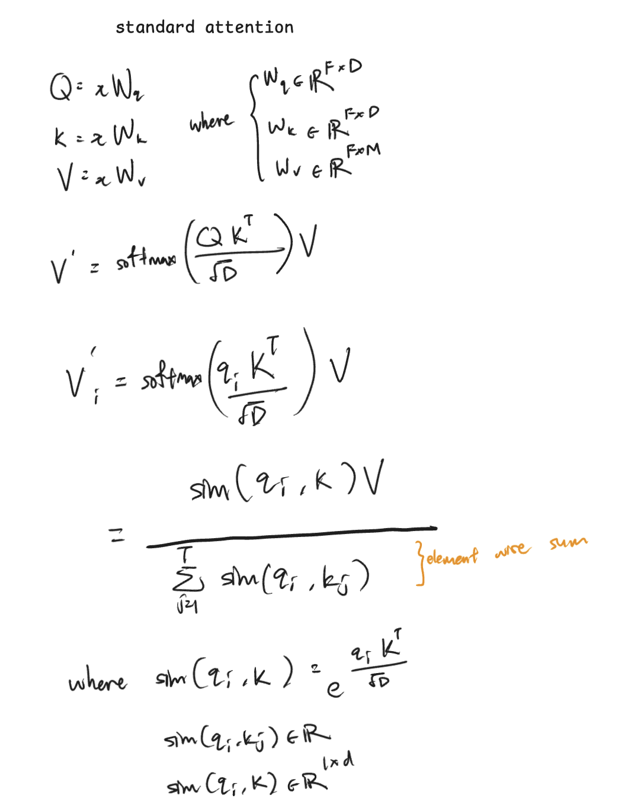
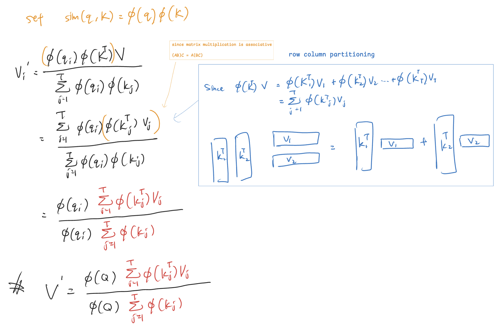
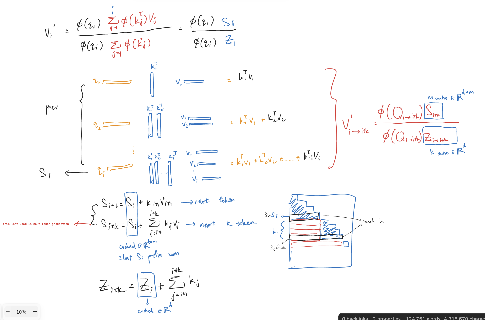
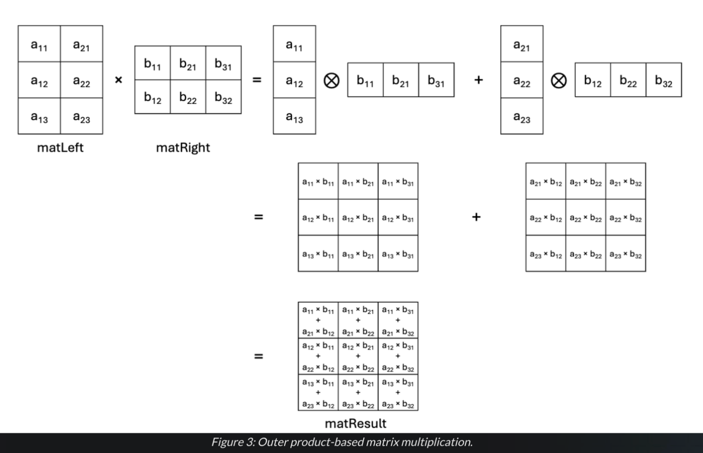
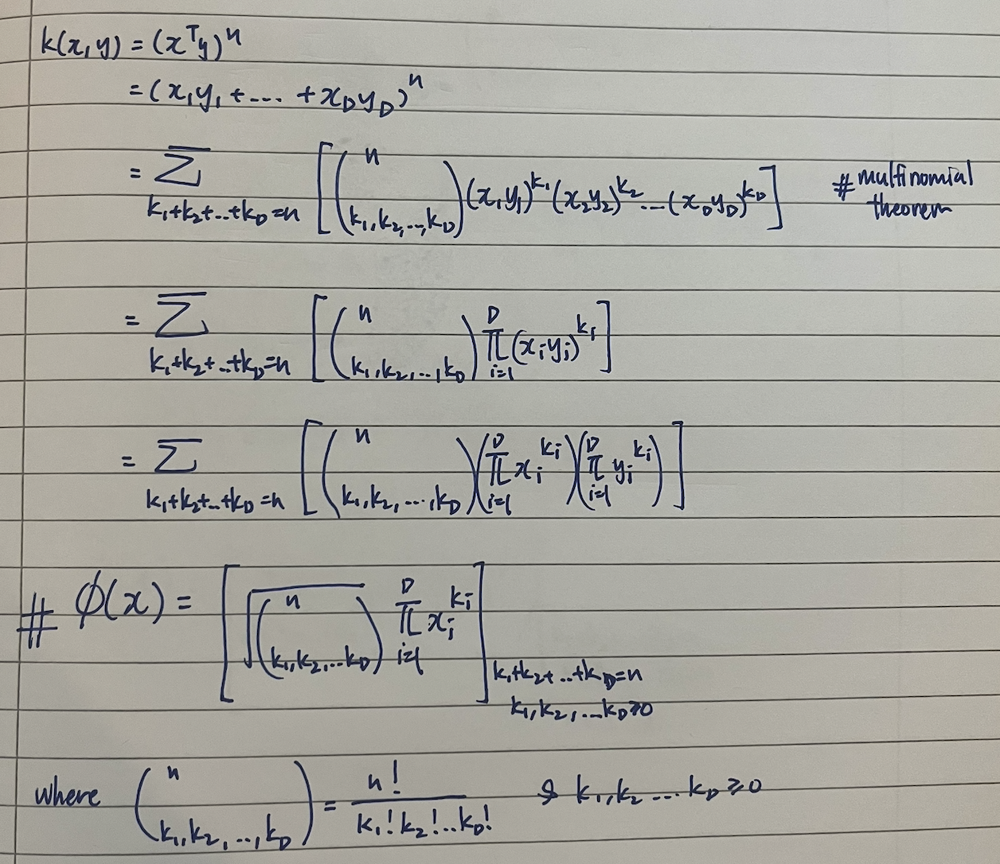
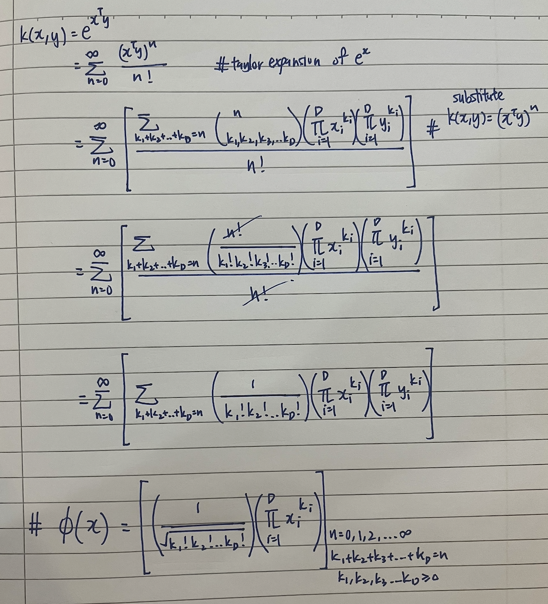

# Linear Attention

paper: https://arxiv.org/pdf/2006.16236

## 1. Normal Attention
 
Note: 
- $V_{i}$ = i-th row of matrix $V$, for the sequence length dimension.
- the D scaling of the denominator will be discarded in later sections.

## 2. Linear Attention

We use a kernelized approximation of softmax attention, where
$e^{A B^\top}$ is approximated by an inner product in feature space:

$e^{A B^\top} \approx \phi(A)\, \phi(B^\top)$

 

## Caching (Inference only)

 
Note: 
- we cannot use caching during training because the previous keys and values will be different after backprop.
- Hence, we need to feed in the entire sequence and regenerate the keys and values from scratch.

## Extra 1: Outer Product Based MatMul 
 

Note:
- this is an outer product based since we only partition it into rows and cols.
- we can also split multiple cols and rows at once, it would just be the sum of mat mul instead

IF and ONLY IF $A \in \mathbb{R}^{N \times 1}$ and $B \in \mathbb{R}^{1 \times M}$, 
 
$AB = A \otimes B$, ie the outer product is the same as the mat mul.

# Extra 2: derivation of the infinite dimensional exact function map

#### prerequisite: 
- multinomial theorem: https://en.wikipedia.org/wiki/Multinomial_theorem
- taylor expansion of $e^x$: https://en.wikipedia.org/wiki/Taylor_series

#### derivation:

1. kernel of $(x^Ty)^n$ , 
   1. this is finite dimensional kernel.
   2. the num of elements here is already huge.

 
 
 

2. kernel of $e^{x^\top y}$, which is the <b>similarity function for softmax<b>.
   1. this is <b>infinite dimensional kernel.<b>
   
 
 
 
