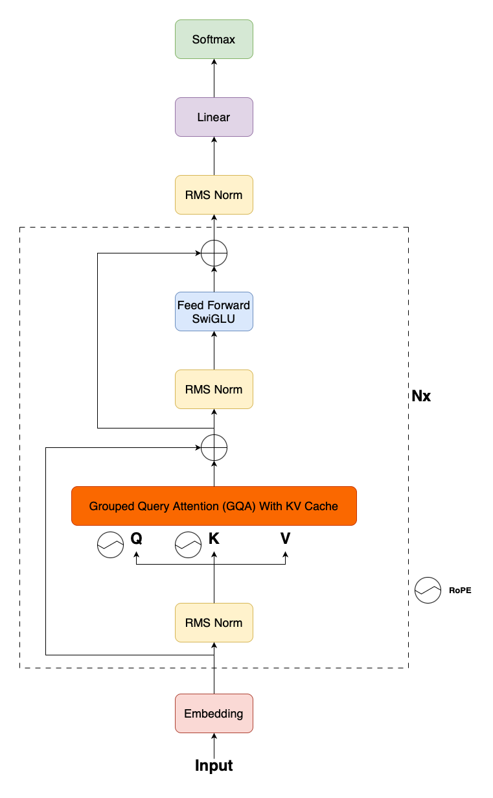

# Llama Architecture



This implementation is based on: https://github.com/uygarkurt/Llama-3-PyTorch/tree/main
see repository on how to load the official llama weights into the model class.

model download: https://github.com/meta-llama/llama-models/issues/421

# 1. FeedForward with SwiGLU

## swish activation (SILU)


https://en.wikipedia.org/wiki/Swish_function

https://docs.pytorch.org/docs/stable/generated/torch.nn.SiLU.html

## GLU gated linear unit


https://medium.com/deeplearningmadeeasy/glu-gated-linear-unit-21e71cd52081

has a gating function that performs element wise multiplication.

learns:

- Which hidden dimensions to amplify
- Which to suppress
- Context-dependent feature selection

## SwiGLU


https://medium.com/@s_boudefel/exploring-swiglu-the-activation-function-powering-modern-llms-9697f88221e7

```python
class FeedForwardSwiGLU(nn.Module):
    def __init__(self, params):
        super(FeedForwardSwiGLU, self).__init__()
        if params.ffn_dim is None:
            params.ffn_dim = _get_ffn_dim(4 * params.dim, params.ffn_dim_multiplier, params.multiple_of)
        self.w1 = nn.Linear(params.dim, params.ffn_dim, bias=False)
        self.w2 = nn.Linear(params.dim, params.ffn_dim, bias=False)
        self.proj = nn.Linear(params.ffn_dim, params.dim, bias=False)

    def forward(self, x):
        return self.proj(F.silu(self.w1(x)) * self.w2(x))  # element wise multiplication
```

basically GLU but using swish instead of sigmoid.

# 2. Grouped Query Attention


paper: https://arxiv.org/pdf/2305.13245

query, key, value weight matrices:

```python 
# Note: n_heads > n_kv_heads
self.wq = nn.Linear(params.dim, params.n_heads * params.dim_head, bias=False)
self.wk = nn.Linear(params.dim, params.n_kv_heads * params.dim_head, bias=False)
self.wv = nn.Linear(params.dim, params.n_kv_heads * params.dim_head, bias=False)
```

query, key, values:

```python
B, T, _ = x.shape
q, k, v = self.wq(x), self.wk(x), self.wv(x)  # q -> (B, T, n_head*dim_head) | k, v -> (B, T, n_kv_head*dim_head)

q = q.view(B, T, self.params.n_heads, self.params.dim_head)
k = k.view(B, T, self.params.n_kv_heads, self.params.dim_head)
v = v.view(B, T, self.params.n_kv_heads, self.params.dim_head)
```

rotary positional embedding is applied to query & keys:<br>


```python
q, k = apply_rotary_emb(q, k, freqs_cis=freqs_cis)
```

kv_caching is applied:<br>

<br>
<br>

```python
def __init__(self, ...):
    ...
    # kv cache
    self.cache_k = torch.zeros(
        (
            params.max_batch_size,
            params.max_seq_length,
            params.n_kv_heads,
            params.dim_head
        )
    )

    self.cache_v = torch.zeros(
        (
            params.max_batch_size,
            params.max_seq_length,
            params.n_kv_heads,
            params.dim_head
        )
    )


def forward(self, x, start_pos, freqs_cis, mask):
    # Note: x will only contain the last tokens. 
    # if we only predict 1 at a time, it will only contain the predicted token. Hence, the seq_len is 1.
    ...
    # writing k into their corresponding position in the kv cache
    # start_pos is where the uncached input starts, ie: where x starts,
    # since in kv caching we only provide the uncached input in as x.
    self.cache_k[:B, start_pos: start_pos + T] = k
    self.cache_v[:B, start_pos: start_pos + T] = v

    # we then fetch the appended k, v cache that includes the newest lines to do attention
    k = self.cache_k[:B, start_pos: start_pos + T]
    v = self.cache_v[:B, start_pos: start_pos + T]
```

keys & values will be duplicated to match the query shape:<br>


```python
# Note: n_kv_head_rep = n_head // n_kv_head

# In these runs we duplicate the KV heads for MQA in all GPUs (llama2)
k = torch.repeat_interleave(
    k, dim=2, repeats=self.params.n_kv_head_rep
)  # (B, T, n_kv_heads, dim_head) -> (B, T, n_heads, dim_head)
v = torch.repeat_interleave(
    v, dim=2, repeats=self.params.n_kv_head_rep
)  # (B, T, n_kv_heads, dim_head) -> (B, T, n_heads, dim_head)
```

normal scaled attention is then performed:<br>


https://docs.pytorch.org/docs/stable/generated/torch.nn.functional.scaled_dot_product_attention.html

```python
# Reshaping for scaled_dot_product_attention. expected = (B, ..., T, head_dim)
q = q.transpose(1, 2)  # (B, T, n_heads, dim_head) -> (B, n_heads, T, dim_head)
k = k.transpose(1, 2)  # (B, T, n_heads, dim_head) -> (B, n_heads, T, dim_head)
v = v.transpose(1, 2)  # (B, T, n_heads, dim_head) -> (B, n_heads, T, dim_head)

# takes care of the entire attention process
# Note that the n_heads are all processed in parallel
out = F.scaled_dot_product_attention(q, k, v, attn_mask=mask)  # (B, n_heads, T, dim_head)
```