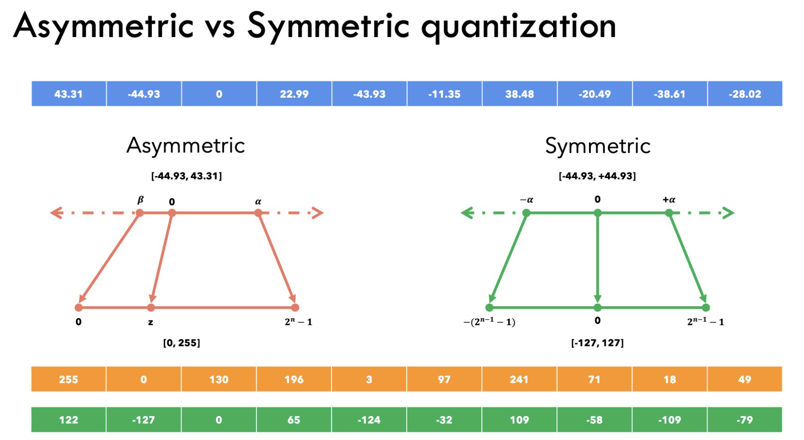
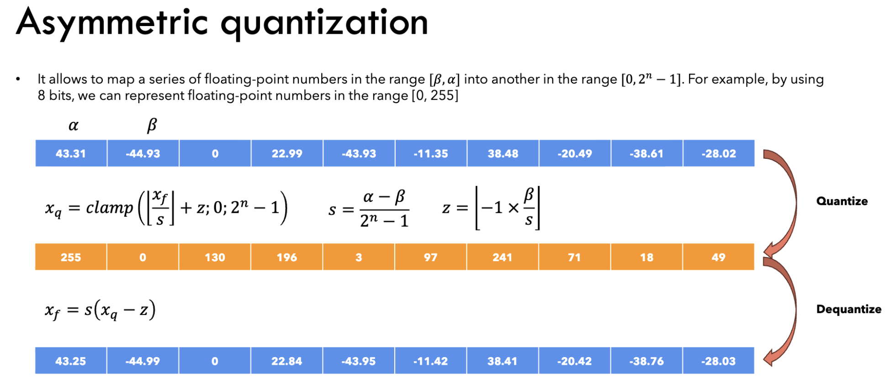
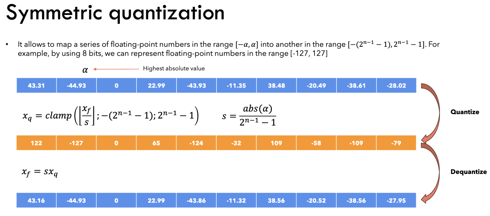
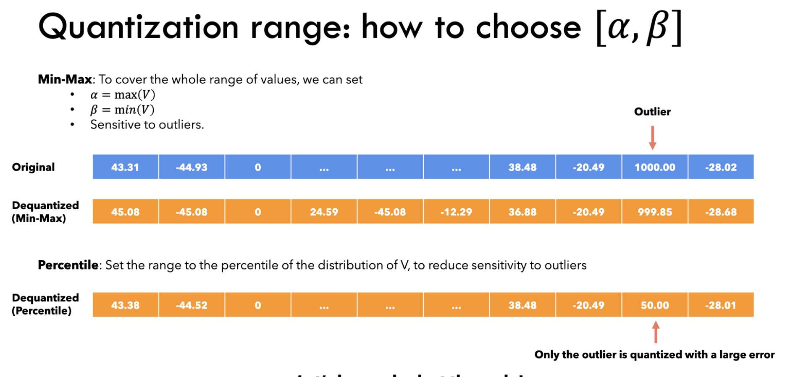
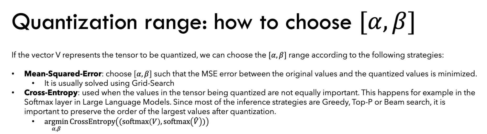
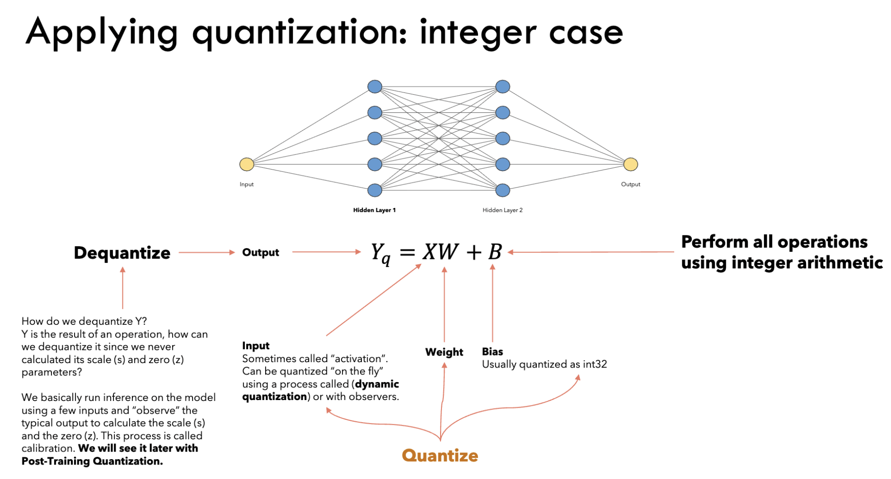

 Official torchao intro: https://docs.pytorch.org/ao/stable/quantization_overview.html#

Github:
 quantization: https://github.com/pytorch/ao/blob/main/torchao/quantization/README.md
 qat: https://github.com/pytorch/ao/tree/main/torchao/quantization/qat

Blogs:
https://selek.tech/posts/static-vs-dynamic-quantization-in-machine-learning/

 

# Asymmetric Quantisation

 

Derivation: 
Note: clamping values to min and max is omitted for brevity 

 

# Symmetric Quantisation

 

Derivation: 
Note:

- clamping values to min and max is omitted for brevity 
- 1 bit is actually unused on the negative side to maintain symmetry
- if the original range is symmetric, the scaled unused range is small.
   

# Different strategies to choose a, b

 
 

# Applying Quantization

 
 